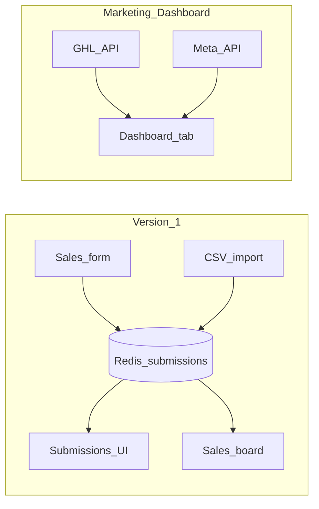

# ESA Sales Command Center: 1.0 vs 2.0

## 1.0 (current)

Shipped scope:

- **Submissions** as the spreadsheet on the site: Redis-backed rows, **Export CSV**, **Import CSV**, **Sales** form (**GHL** or **Dashboard only**).
- **Sales board** KPIs from that same log: counts, paid/owed, by product/stage, payment-plan %, **lead → close** and **call → close** (Closed Won rows with **Date created** / **1st call** and **Closing date**). See [`api/sales-stats.js`](api/sales-stats.js).
- **Deploy**: monorepo folder [`esa-marketing-sales-dashboard/`](./), Vercel **Root Directory** = this folder; env includes `DEAL_UPLOAD_SECRET`, Redis, and GHL/Meta for the **Dashboard** tab. See [`DEPLOY.md`](DEPLOY.md), [`VERCEL_ESA_DASHBOARD.md`](../VERCEL_ESA_DASHBOARD.md) (repo root).

The **Dashboard** tab (marketing view) uses **GHL + Meta** (+ optional Google Sheets). It does **not** read the Redis submissions list. That split is intentional for 1.0.

## 2.0 (later)

Optional follow-ons when you want deeper CRM/marketing alignment and ops workflows:

| Theme | Examples |
|--------|----------|
| **Edit / reconcile** | Row update or **replace-from-CSV** without duplicate rows; tighter use of **Contact** / **Opp** IDs on rows for audit. |
| **Enrichment** | Lookup GHL by email to prefill Campaign / Adset / tags from contact custom fields. |
| **Marketing alignment** | Bridge Redis-only vs GHL; filter Sales board by **closing date** as well as **submitted**. |
| **Reporting** | By setter/closer, by `sourceTag`, revenue by close month. |

2.0 is **not** required for 1.0 to be complete or valuable.

## Related docs

- [README.md](./README.md) — setup and env
- [ESA_SALES_SYSTEM.md](./ESA_SALES_SYSTEM.md) — tags, stages, SOP
- [SUBMISSIONS_IMPORT_CSV.md](./SUBMISSIONS_IMPORT_CSV.md) — bulk import
